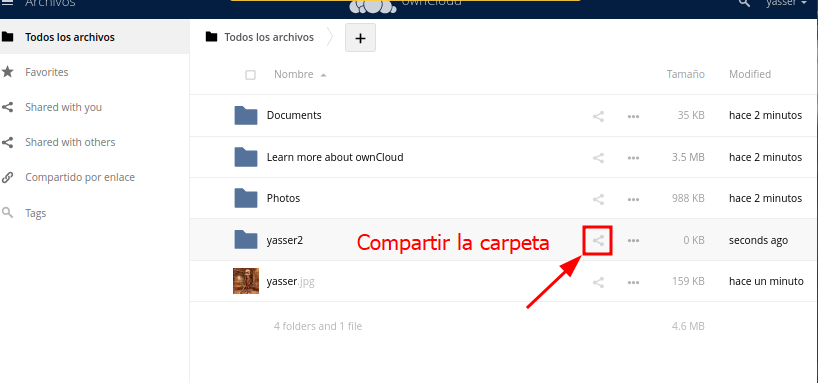
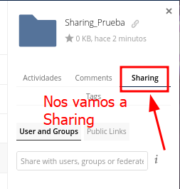

# CONFIGURATION.md

## Inicio

1. Crear cuenta en OwnCloud

   

3. Inicia sesion

   

## 1. Subida de archivos

1. Haz clic en el icono “+” para desplegar opciones de subida.

   

2. Selecciona “Upload” y elige el archivo desde tu equipo.

   

3. Verifica que el fichero aparece en la lista.

   

---

## 2. Creación de carpetas

1. Pulsa el icono “+” y selecciona “New folder”.

   

2. Introduce el nombre deseado.

   

3. Comprueba que la carpeta se ha creado.

   

---

## 3. Compartir contenido

1. Selecciona el recurso (archivo o carpeta) que quieras compartir.

   

2. Elige compartir con grupos o mediante enlace público:
   - Compartir con grupos:

     

   - Compartir con enlace público:

     

---

## 4. Creación de usuarios

1. Haz clic en tu avatar (esquina superior derecha) y entra en “Users”.

   
   

2. Rellena el formulario y pulsa “Create user”.

   
   

---

## 5. Asignación de roles y permisos

### 5.1 Crear roles (grupos)

1. Ve a “Groups”.

   

2. Añade un nuevo grupo como rol (ej. ‘editor’, ‘visualizador’).

   

3. Asigna roles a los usuarios.

   

### 5.2 Configurar permisos por rol

1. Selecciona el archivo o carpeta deseada y abre el panel de “Sharing”.

   
   

2. En “Users and groups” añade el rol.

   
   

3. Haz clic en la rueda de configuración y ajusta permisos.

   
   

---

## 6. Organización de archivos y carpetas

### 6.1 Mover archivos

1. Selecciona el archivo y arrástralo a la carpeta destino.

   
   

### 6.2 Favoritos

1. Pasa el ratón sobre el recurso y haz clic en la estrella.

   
   

### 6.3 Renombrar para ordenar

1. Pulsa los tres puntos junto al recurso y selecciona “Rename”.

   
   

---

## 7. Políticas de seguridad

1. En “Preferences” (avatar > Preferences) accede a “Sharing”.

   
   
   

2. Ajusta políticas: caducidad de enlaces, restricción de dominios, aprobación de compartidos.

   

---

## 8. Acceso desde otra máquina

1. Obtén la IP local de la VM:

   

2. Verifica que Apache2 está activo:

   

3. Edita `config.php` y añade la IP en `trusted_domains`:

   

5. Accede desde otro equipo a `https://<IP_LOCAL>`.

---

**¡Configuración completada!** Ahora ownCloud está listo para uso colaborativo con usuarios, roles y políticas ajustadas.
