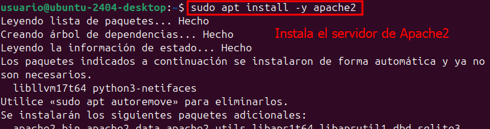

# INSTALLATION.md

## 1. Configuración de la máquina virtual (IsardVDI)

1. Accede al portal de IsardVDI y crea un nuevo escritorio:
   
   ```
   - Selecciona Ubuntu Desktop como plantilla.
   - Asigna un nombre descriptivo (ej. `Gestor de Archivos Web`).
   ```

   
   
   

2. Configura recursos de la VM:
   - CPU: 8 vCPUs
   - Memoria: 32 GB RAM

3. Inicia la VM y conéctate vía VNC o SPICE.

---

## 2. Actualización del sistema e instalación de dependencias

1. Actualiza el índice de paquetes e instala actualizaciones:
   ```bash
   sudo apt update && sudo apt upgrade -y
   ```
   
   

2. Instala Apache2:
   ```bash
   sudo apt install -y apache2
   ```

   

3. Instala MySQL Server:
   ```bash
   sudo apt install -y mysql-server
   ```

   

4. Instala PHP y librerías necesarias para OwnCloud:
   ```bash
   sudo apt install -y php libapache2-mod-php
   ```

   

5. Reinicia Apache para aplicar cambios:
   ```bash
   sudo systemctl restart apache2
   ```

   

---

## 3. Configuración de la base de datos MySQL

1. Accede a la consola de MySQL:
   ```bash
   sudo mysql
   ```
   

2. Crea la base de datos `bbdd`:
   ```sql
   CREATE DATABASE bbdd;
   ```
   

3. Crea un usuario dedicado y asigna contraseña:
   ```sql
   CREATE USER 'usuario'@'localhost' IDENTIFIED WITH mysql_native_password BY 'password';
   ```
   

4. Concede privilegios al nuevo usuario:
   ```sql
   GRANT ALL ON bbdd.* TO 'usuario'@'localhost';
   ```
   

5. Sal de MySQL:
   ```sql
   exit
   ```
   

6. Verifica la conexión con el nuevo usuario:
   ```bash
   mysql -u usuario -p
   ```
   

---

## 4. Despliegue de ownCloud

1. Sitúate en el directorio raíz de Apache:
   ```bash
   cd /var/www/html
   ```
   

2. Descarga y descomprime ownCloud (asegúrate de usar la versión estable adecuada):
   ```bash
   wget https://download.owncloud.com/server/stable/owncloud-complete-20240724.zip
   unzip owncloud-complete-20240724.zip
   rm owncloud-complete-20240724.zip
   mv owncloud/* .
   rmdir owncloud
   rm index.html
   ```

3. Ajusta propietarios y permisos:
   ```bash
   sudo chown -R www-data:www-data /var/www/html
   sudo find /var/www/html -type d -exec chmod 750 {} \;
   sudo find /var/www/html -type f -exec chmod 640 {} \;
   ```
   

4. Preparar PPA para PHP ≤ 7.4 y cambiar versión si es necesario:
   ```bash
   sudo apt install software-properties-common -y
   sudo add-apt-repository ppa:ondrej/php
   sudo apt update
   sudo apt install php7.4 php7.4-{fpm,cli,gd,xml,mbstring,curl,mysql} -y
   sudo a2dismod php8.0 && sudo a2enmod php7.4
   sudo systemctl restart apache2
   ```

   
   

5. Accede desde el navegador a `http://localhost/` y finaliza la instalación a través del asistente.

   

---

**¡Listo!** La VM y ownCloud están instalados y accesibles. Continúa con la configuración de usuarios y permisos en `CONFIGURATION.md`.
